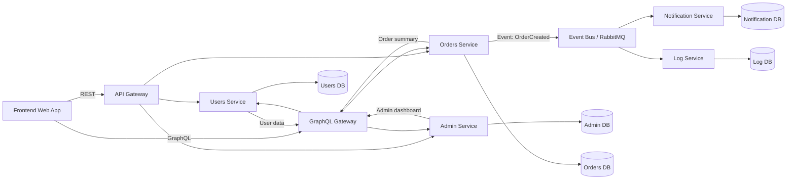
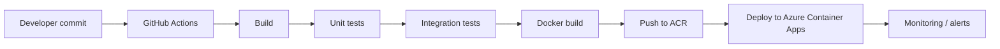

# System Architecture Design

## 1. Overblik

Dette system er bygget som et simpelt microservice-arkitektur, hvor frontenden kommunikerer med et API Gateway, som derefter sender forespørgsler videre til de relevante backend-tjenester.

Systemet består af 5 mikroservices:

- Users Service
- Admin Service
- Orders Service
- Notification Service
- Log Service

## 2. Systemarkitektur

## 3. Hvordan frontend interagerer med backend

### REST

Frontend bruger REST til almindelige opgaver som:

- Opret bruger
- Opdater brugerprofil
- Opret ordre
- Slet/administer data
- Hent detaljer om et specifikt element

Eksempler:

- GET /api/users/42
- POST /api/orders
- PUT /api/admin/users/42

Dette er godt til enkle, klare operationer, hvor vi ved præcis, hvilken ressource der skal hentes eller opdateres.

### GraphQL

Frontend bruger GraphQL til dashboards og komplekse forespørgsler, hvor flere data skal hentes i én kald.

Eksempel:

- Hent brugerinfo + ordrehistorik + seneste logfiler i ét enkelt GraphQL-kald.

Dette gør frontend mere effektivt og reducerer antallet af netværksanmodninger.

## 4. Kommunikationskanaler

### Uden for systemet

- Frontend til API Gateway: HTTPS
- Frontend til GraphQL Gateway: HTTPS
- Brugere til systemet går kun via API Gateway, så systemet bliver mere sikkert og lettere at styre

### Inde i systemet

- Mikroservices kommunikerer med hinanden via REST over interne netværk
- Asynkron kommunikation sker via Event Bus (fx RabbitMQ eller Kafka)
- Services sender events som:
  - UserCreated
  - OrderCreated
  - OrderCancelled
  - LogRecorded

### Databaser

Hver microservice har sin egen database, så de er uafhængige af hinanden.

## 5. Valgte arkitektoniske mønstre

### API Gateway Pattern

Et centralt gateway håndterer alle indgående forespørgsler fra frontend. Det sørger for:

- sikkerhed
- routing
- auth/token validering
- rate limiting

### CQRS

Vi bruger CQRS til Admin- og Orders delen, hvor:

- Command-side håndterer skrivning og ændringer
- Query-side håndterer læsning og visning

Dette forbedrer performance for dashboard-visninger og reducerer belastning på skrive-databasen.

### Event-Driven Architecture

Nogle handlinger skal ikke være synkrone. Når en ordre oprettes, sender Orders Service et event, som Notification Service og Log Service reagerer på.

### Snapshot Pattern

For Log Service anvender vi snapshot pattern, så vi ikke altid skal læse hele eventstreamen for at få status. Vi gemmer periodiske snapshots af tilstande, og bruger dem til hurtigere visning og analyse.

## 6. Beslutning om systemets opbygning

Systemet er designet til at være:

- simpelt
- let at forstå
- nemt at udvide
- godt til undervisning og opgavebesvarelse

Det er ikke et fuldt enterprise-system, men det viser de rigtige principper, som man bruger i moderne microservice-arkitektur.

## 7. Ansvarsfordeling i teamet

| Teammedlem                    | Ansvar                                                | Del af system                |
| ----------------------------- | ----------------------------------------------------- | ---------------------------- |
| Frontend Developer            | Bygger brugergrænsefladen og kommunikerer med API'er | Frontend app                 |
| Backend Developer 1           | Users Service og brugerlogik                          | Users microservice           |
| Backend Developer 2           | Admin Service og dashboard-logik                      | Admin microservice           |
| Backend Developer 3           | Orders Service og forretningslogik                    | Orders microservice          |
| DevOps / Integration Engineer | API Gateway, Event Bus, deployment, monitoring        | Infrastruktur og integration |
| QA / Tester                   | Teste REST, GraphQL, event-flow og sikkerhed          | Test og kvalitet             |

## 8. Kort sammenfatning

Dette system viser hvordan en frontend kan bruge både REST og GraphQL, mens mikroservices arbejder sammen gennem API Gateway og events. Systemet er opdelt i ansvarsområder, så hver service kan udvikles og deployes uafhængigt.

Det er en enkel men realistisk løsning, som er godt egnet til en skole- eller eksamensopgave.

## 9. Konklusion

Hvis jeg skulle implementere dette system, ville jeg vælge:

- Frontend: React or Vue
- API Gateway: NGINX / Kong / Spring Cloud Gateway
- REST calls for CRUD
- GraphQL for aggregated dashboard queries
- Event Bus: RabbitMQ
- Database per service
- CQRS + Event-driven + Snapshot pattern

Dette giver en god balance mellem enkelhed, skalerbarhed og læring.

## 10. Deployment strategy

### 10.1 Cloud provider vurdering
Jeg vil vælge Microsoft Azure som cloud provider, fordi det passer godt til et microservice-system med:

- container-orchestration via Azure Kubernetes Service (AKS) eller Azure Container Apps
- managed databaser som Azure Database for PostgreSQL
- event streaming via Azure Service Bus
- API-gateway løsninger som Azure API Management
- overvågning og logging via Azure Monitor, Log Analytics og Application Insights
- CI/CD integration med GitHub Actions eller Azure DevOps

Andre muligheder kunne være AWS og Google Cloud, men Azure er det mest naturlige valg i en undervisnings- eller virksomhedssammenhæng, når systemet er bygget i moderne cloud-native stil.

### 10.2 Valgt cloud-løsning
Jeg vil deployere systemet på Azure med følgende struktur:

- Frontend: Azure Static Web Apps eller Azure App Service
- API Gateway: Azure API Management
- Microservices: Azure Container Apps eller AKS
- Databaser: Azure Database for PostgreSQL / Azure Cosmos DB afhængig af behov
- Event bus: Azure Service Bus
- Logging og monitoring: Azure Monitor + Application Insights + Log Analytics

For et simpelt system vil Azure Container Apps være den mest passende løsning, fordi det er lettere at konfigurere end AKS og stadig giver god skalerbarhed, autoscaling og simple deployment pipelines.

### 10.3 CI/CD pipeline
Jeg vil bruge GitHub Actions som CI/CD platform.

Flow:

1. Udvikler laver pull request til main-branche
2. GitHub Actions starter automatiske kontroller
   - kodebuild
   - unit tests
   - linting
   - sikkerhedsscan
3. Hvis alle checks passer, bygger systemet
4. Docker images bygges for hver microservice
5. Images pushes til Azure Container Registry (ACR)
6. Deployment sker automatisk til udviklingsmiljø
7. Efter godkendelse deployes til produktion

Eksempel på pipeline:

Jeg vil også bruge environment-based deployment, så der er separate miljøer for:

- Development
- Staging
- Production

### 10.4 Test strategy i CI/CD
Jeg vil have en tre-lags teststrategi:

#### Unit tests
Disse tester hver service isoleret.

Eksempler:
- brugeroprettelse logik
- ordrevalidering
- adgangskontrol
- service-lag som validation og transformation

Unit tests køres ved hver commit og skal være hurtige.

#### Integration tests
Disse tester, hvordan en service kommunikerer med:

- sin database
- API Gateway
- event bus
- andre services via REST

Eksempel:
- når en bruger oprettes, gemmes den korrekt i Users DB
- når en ordre oprettes, sendes et event til Service Bus
- Notification service modtager event og opretter meddelelse

Disse tests køres i CI-pipeline efter unit tests.

#### System-level cooperation tests
Disse tester hele systemets samarbejde som et samlet flow.

Eksempler:
- bruger opretter sig
- bruger placerer ordre
- order service udsender event
- notification service og log service reagerer
- frontend viser den opdaterede status

Målet er at verificere, at hele systemet fungerer sammen, ikke kun individuelle services.

### 10.5 Integration af tests i pipeline
CI/CD-pipeline vil typisk se sådan ud:

1. Lint + build
2. Unit tests
3. Integration tests
4. System tests
5. Docker build
6. Deploy til staging
7. Smoke tests
8. Deploy til production

Hvis et trin fejler, stopper pipeline og deployment afbrydes.

### 10.6 Logging og monitoring i produktion
For at kunne overvåge systemet i produktion vil jeg bruge følgende værktøjer:

#### Logging
- Application Insights for applikationslogs
- Azure Monitor / Log Analytics for central loginsamling
- Structured logging fra hver microservice
- Correlation IDs for at spore en request gennem alle services

Jeg vil logge:
- start/fejl i requests
- event-fejl
- database-fejl
- timeout og retry-misser
- sikkerhedsrelaterede hændelser

#### Monitoring
- metrics for CPU, memory, latency, request count
- alerting på høj fejlrater eller lange responstider
- dashboards til systemstatus
- tracing med OpenTelemetry eller Azure-native tracing

Dette vil gøre det muligt at se, hvor fejl opstår, og om et service er overbelastet.

### 10.7 Sikkerheds- og driftsovervejelser
For at gøre systemet stabilt i produktion vil jeg også have:

- rate limiting på API Gateway
- HTTPS kun
- secrets i Azure Key Vault
- autoscaling på services
- retries og circuit breakers til service-to-service kommunikation
- backups af databaser
- alerts på kritiske fejlsituationer

## 11. Samlet konklusion
Deploymentsstrategien vil være cloud-native og enkel: Azure Container Apps, Azure API Management, Azure Service Bus, Azure Monitor og GitHub Actions. Dette giver en stærk kombination af skalerbarhed, automatisering og overvågning, mens CI/CD-pipeline sikre hurtige og pålidelige releaser.

Det er en passende løsning for et simpelt fem-service system, hvor hver mikroservice udvikles uafhængigt, men stadig fungerer sammen som ét samlet system.
